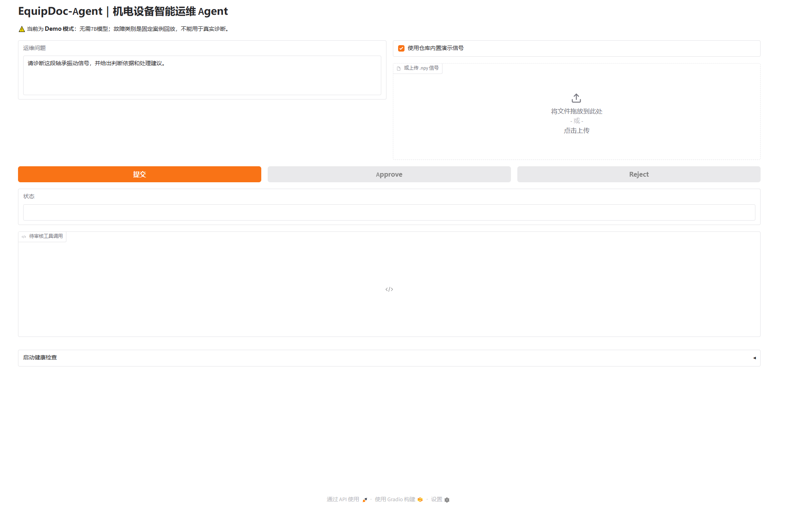
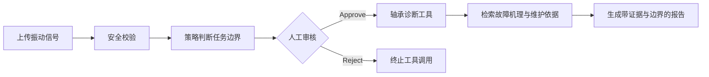
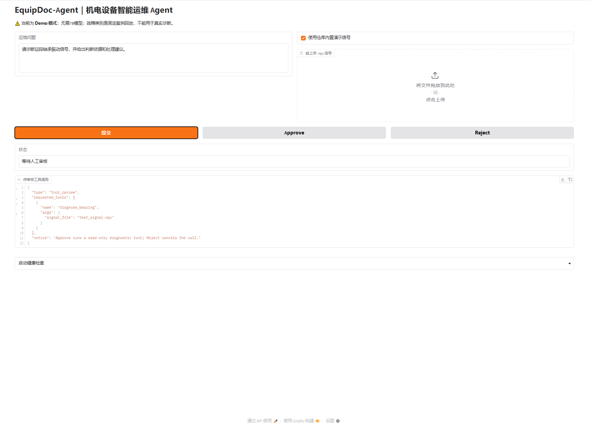
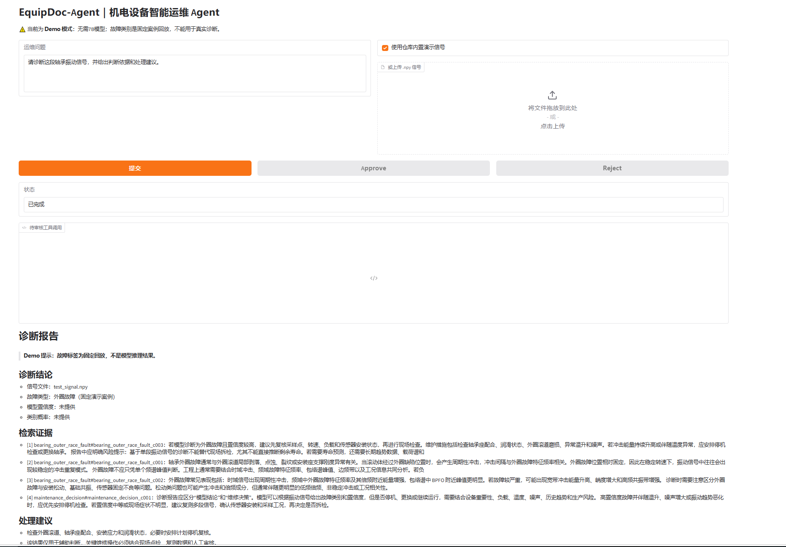

# EquipDoc-Agent

[](https://github.com/yu123-tqy/equipdoc-agent/actions/workflows/ci.yml)
[](pyproject.toml)
[](LICENSE)

面向机电设备运维场景的可审核、可降级 Agent。项目将确定性安全策略、LangGraph 人工审核、轴承振动信号诊断工具、可选 RAG 和证据化报告组织为一个可复现的公开工程作品。

> 当前公开版本默认运行在无模型 Demo 模式：可以完整演示 Agent 工作流，但故障类型是明确标注的固定案例回放，不能作为真实设备诊断结果。Full 模式需要单独配置 Qwen 服务、CNN 权重和可选向量库。



## 30 秒了解项目

| 项目维度 | 当前实现 |
|---|---|
| 目标场景 | 轴承振动信号辅助分析与运维报告生成 |
| Agent 编排 | LangGraph 状态图、条件路由、可恢复中断 |
| 人机协同 | 诊断工具执行前必须 Approve/Reject |
| 工具能力 | `.npy` 信号校验、CNN 诊断接口、知识检索、报告生成 |
| 安全边界 | 上传沙箱、大小与数值检查、路径白名单、显式降级 |
| 运行方式 | 本地 Gradio、Docker、AutoDL Full 模式 |
| 当前证据 | 单元测试、Smoke Test、历史实验文件和限制说明 |

## 为什么需要这个 Agent

通用大模型无法直接分析振动时序信号，也容易在设备信息不足时生成缺少依据的维修建议。本项目把自然语言交互与专用诊断工具分离，并在高影响工具调用前加入人工审核：



项目不控制真实设备，不替代工程师作出高风险维修决策，也不根据单段信号预测精确剩余寿命。

## 核心能力

- **可审核工作流**：使用 LangGraph interrupt/resume，在工具执行前展示调用参数并等待审批；
- **确定性安全策略**：信号和诊断意图同时满足时才进入诊断分支，关键判断不依赖 LLM 自由发挥；
- **受限信号工具**：只接受沙箱内、受限大小、有限数值的 `.npy` 一维信号；
- **显式降级**：缺少 Qwen、CNN 权重或 Chroma 时不静默伪装，Demo 模式和词法检索会明确标注；
- **证据化输出**：报告区分输入事实、工具结果、检索依据、建议和适用边界；
- **可复现工程骨架**：包含 `pyproject.toml`、环境变量、Docker、健康检查、Smoke Test 和 CI。

## 演示结果

诊断工具调用前，系统会暂停工作流并等待人工审核。审核界面只展示工具名称和经过脱敏的文件名，不暴露服务器内部路径。



审批通过后，系统输出带 Demo 标识、检索证据、处理建议和适用边界的报告：



## 快速运行 Demo

### 1. 环境要求

- Python 3.10、3.11 或 3.12；
- Demo 模式不需要 GPU、Qwen 模型、CNN 权重或向量库。

### 2. 创建环境并安装

Windows PowerShell：

```powershell
python -m venv .venv
.\.venv\Scripts\Activate.ps1
python -m pip install --upgrade pip
pip install -e ".[demo]"
Copy-Item .env.example .env
```

Linux / AutoDL：

```bash
python -m venv .venv
source .venv/bin/activate
python -m pip install --upgrade pip
pip install -e ".[demo]"
cp .env.example .env
```

### 3. 健康检查与测试

```bash
python -m equipdoc_agent.health --strict
python scripts/demo_smoke.py
python -m unittest discover -s tests -v
```

Demo 模式下，`bearing_model`、`bearing_norm` 和 `rag_vector_db` 可以显示为不存在，因为它们不是必需项。

### 4. 启动页面

```bash
python app_gradio.py
```

打开终端显示的本地地址，默认是：

```text
http://127.0.0.1:7860
```

若 `7860` 已被占用，应用会自动尝试 `7861`、`7862` 等端口。

### 5. 体验审核流程

1. 保持“使用仓库内置演示信号”为勾选状态；
2. 使用默认问题“请诊断这段轴承振动信号，并给出判断依据和处理建议”；
3. 点击“提交”，查看待审核的工具名称和参数；
4. 点击 `Approve` 继续生成报告，或点击 `Reject` 验证拒绝分支；
5. Demo 报告会明确说明结果是固定案例，不是真实模型推理。

## 运行模式

| 模式 | 用途 | 必需资源 | 输出边界 |
|---|---|---|---|
| Demo | 公开仓库复现、工作流演示 | Demo 依赖、内置信号 | 固定故障案例，明确标注 |
| Full | AutoDL 或 GPU 环境实验 | Qwen 服务、CNN 权重，可选向量库 | 使用实际工具结果，仍需人工复核 |

## Docker Demo

```bash
docker compose up --build
```

浏览器打开 `http://127.0.0.1:7860`。Docker 镜像只包含 Demo 所需依赖，不包含7B模型和 Torch。

## AutoDL Full 模式

### 1. 安装完整依赖

```bash
pip install -e ".[demo,ml,rag]"
```

### 2. 准备本地模型文件

把文件放在配置指定位置，不要提交 GitHub：

```text
models/bearing_cnn.pth
data/processed/norm.npy
```

### 3. 配置服务

在 `.env` 中修改：

```dotenv
EQUIPDOC_DEMO_MODE=false
EQUIPDOC_LLM_BASE_URL=http://127.0.0.1:8000/v1
EQUIPDOC_LLM_MODEL=qwen-equipdoc
EQUIPDOC_LLM_API_KEY=EMPTY
```

Qwen 服务应提供 OpenAI-compatible `/chat/completions` 接口。模型继续保留在 AutoDL，不应把大模型权重上传 GitHub。

Full 模式的知识问答会先检索公开知识切片，再把证据与完整 `doc_id#chunk_id` 交给 Qwen。高保证回答守卫要求每条技术陈述逐字摘录一条检索证据并在句末引用；首轮不合格时重试一次，再失败则隐藏草稿并返回带逐句引用的抽取式证据。真实模型的20条质量与p50/p95延迟评测流程见 [`docs/p2-autodl-full-evaluation.md`](docs/p2-autodl-full-evaluation.md)。在 AutoDL 结果回传前，仓库不预先声明 Full 模式性能。

### 4. 可选：构建向量库

```bash
python scripts/build_rag_index.py
```

没有向量库时，系统会降级到词法检索，并在健康信息中说明 Dense Retrieval 未启用。

## 项目结构

```text
equipdoc-agent/
├─ app_gradio.py               # Gradio 演示入口
├─ pyproject.toml              # 包、依赖和工具配置
├─ src/equipdoc_agent/
│  ├─ agent/                   # LangGraph、策略和报告
│  ├─ tools/                   # 安全信号诊断工具
│  ├─ rag/                     # Dense/词法检索与降级
│  ├─ models/                  # CNN 结构定义
│  ├─ config.py
│  └─ health.py
├─ data/
│  ├─ samples/                 # 可公开演示信号
│  ├─ knowledge/               # 当前知识笔记
│  └─ eval/                    # 评测输入
├─ tests/                      # 不依赖大模型的基础测试
├─ scripts/                    # Smoke Test、索引和历史脚本
├─ docs/                       # 架构、迁移说明与展示素材
└─ artifacts/legacy/          # 原 AutoDL 历史证据
```

详细设计见 [`docs/architecture.md`](docs/architecture.md)，迁移说明见 [`docs/migration-notes.md`](docs/migration-notes.md)。

## 配置说明

完整示例见 [`.env.example`](.env.example)。

| 变量 | 用途 | 安全默认值 |
|---|---|---|
| `EQUIPDOC_DEMO_MODE` | 是否使用无模型固定案例 | `true` |
| `EQUIPDOC_LLM_BASE_URL` | OpenAI-compatible 服务地址 | 本机8000端口 |
| `EQUIPDOC_BEARING_MODEL_PATH` | CNN 权重路径 | `models/bearing_cnn.pth` |
| `EQUIPDOC_UPLOAD_ROOT` | 上传沙箱 | `runtime/uploads` |
| `EQUIPDOC_MAX_UPLOAD_MB` | 上传大小限制 | `8` |
| `EQUIPDOC_RAG_DB_DIR` | Chroma 目录 | `vector_db/chroma_equipdoc` |
| `EQUIPDOC_EMBEDDING_MODEL` | Embedding 模型 | `BAAI/bge-small-zh-v1.5` |

## 测试与持续集成

本地测试：

```bash
python -m unittest discover -s tests -v
```

`.github/workflows/ci.yml` 会在 GitHub 上使用 Python 3.10、3.11 和 3.12 自动运行单元测试、健康检查和 Demo Smoke Test。

P1 还把 Agent 与 RAG 指标设为回归门槛，防止后续改动静默降低当前基线：

```bash
python scripts/build_knowledge_chunks.py --check
python scripts/eval_agent_workflow.py --min-case-pass-rate 1.00
python scripts/eval_rag_retrieval.py --min-hit-at-5 0.90 --min-mrr-at-10 0.75
python scripts/eval_safety_grounding.py --min-case-pass-rate 1.00
```

## 评测证据与适用边界

当前可复现的 P1 基线：

| 模块 | 结果 | 口径 |
|---|---:|---|
| Agent 工作流 | 30 条总通过率 100% | 无模型 Demo；确定性路由、知识覆盖与人工审核流程 |
| 高风险边界 | 20 条固定用例通过率 100% | 确定性规则、引用有效性与抽取证据一致性 |
| RAG 检索 | Hit@5 91.0%，MRR@10 76.8% | 100 条旧测试；14篇知识文档；文档级相关性 |
| CNN | 暂不报告准确率 | 旧数据不具备可信文件级 Group Split 条件 |

P1 原始口径见 [`docs/evaluation-report.md`](docs/evaluation-report.md)，P1.2 安全与证据评测见 [`docs/p1-2-safety-grounding-report.md`](docs/p1-2-safety-grounding-report.md)，后续本地/AutoDL 操作见 [`docs/p1-autodl-runbook.md`](docs/p1-autodl-runbook.md)。

`artifacts/legacy/` 保存原 AutoDL 结果，用于保留实验链路，不作为最终性能结论：

- 30条 Agent 评测主要验证规则路由和审核分支；
- FP16结果只有9次串行请求，且没有记录GPU型号；
- BNB 4-bit结果是单问题测试；
- 旧CNN随机窗口拆分存在同源数据泄漏风险；
- 100条 RAG 测试集存在，但当前仓库没有原实验的最终 RAG 输出。

在完成跨工况 Group Split、人工 groundedness 审查和可复现实验之前，本项目不宣称“CNN准确率100%”“工具路由100%”或未经复核的“幻觉降低率”。

## 安全与公开边界

- UI只接受上传文件或内置样例，不接受服务器路径输入；
- 上传文件被复制到 `runtime/uploads` 并使用随机文件名；
- 工具只允许读取 `data/samples` 和 `runtime/uploads`；
- 仅接受受限大小的数值型一维 `.npy`；
- Demo 标签不能删除，避免固定案例被误解为真实推理；
- 真实单位代码、内部手册、客户数据、模型权重和密钥不得进入仓库；
- 当前知识库为项目笔记，正式评测前仍需补充权威来源和版本信息。

## Roadmap

下一阶段聚焦可信评测，而不是继续堆功能：

1. 按原始文件和工况进行 Group Split；
2. 分开统计规则路由与 LLM 路由；
3. 扩展安全、异常、多轮和多工具评测；
4. 为知识库补充权威来源和版本信息；
5. 完成 `safety_human_review.csv` 的人工 groundedness 审查；
6. 记录 GPU、依赖版本、并发吞吐和 p95 延迟；
7. 补充面向 AI 产品经理岗位的产品案例文档。

## License

本仓库使用作品展示许可，允许招聘、教育和个人作品评审。第三方模型、数据集、文档和商标仍遵循各自许可，详见 [`LICENSE`](LICENSE) 与 [`NOTICE.md`](NOTICE.md)。
