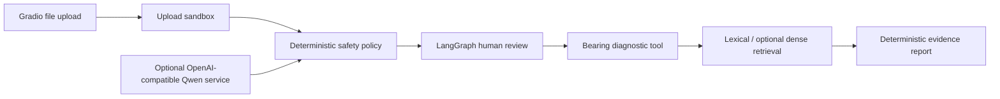

# Architecture

## Modes

### Demo mode

- starts without Qwen weights, CNN weights, Torch, or a vector database;
- validates and summarizes the uploaded signal;
- replays an explicitly labelled fixed diagnostic case;
- provides lexical retrieval over bundled notes;
- is suitable for repository review and UI recording, not real diagnosis.

### Full mode

- connects to an OpenAI-compatible model service;
- loads the bearing CNN lazily on the first tool call;
- optionally adds Chroma dense retrieval;
- refuses startup through `equipdoc-health --strict` when required artifacts are absent.

## Publication boundary

All uploaded files are copied to `runtime/uploads` under generated names. The diagnostic tool only reads files inside `data/samples` or `runtime/uploads`, with extension, size, type, shape, and finite-value checks.

