# Architecture

```mermaid
flowchart LR
    UI["Gradio input and upload"] --> STAGE["Upload sandbox"]
    STAGE --> MODE{"Runtime mode"}
    MODE -->|"Demo or P2 baseline"| BASE["Published graph"]
    MODE -->|"Full plus Agentic opt-in"| SAFE["Deterministic safety gate"]
    SAFE --> PLAN["Qwen strict JSON plan"]
    PLAN --> VALIDATE{"Schema and allowlist"}
    VALIDATE -->|"Missing information"| CLARIFY["Clarification"]
    VALIDATE --> DISPATCH{"Tool permission gate"}
    DISPATCH -->|"Diagnosis"| REVIEW["Approve or Reject"]
    DISPATCH -->|"Read-only"| TOOL["Execute tool"]
    REVIEW --> TOOL
    TOOL --> OBSERVE["Structured observation"]
    OBSERVE --> DECIDE["Qwen next-step decision"]
    DECIDE --> DISPATCH
    DECIDE --> SELECT["Evidence selection"]
    SELECT --> SYNTH["Grounded synthesis"]
    SYNTH --> GUARD{"Citation and term guard"}
    GUARD -->|"Valid"| ANSWER["Final answer"]
    GUARD -->|"Invalid twice"| FALLBACK["Extractive fallback"]
```

## Modes

### Demo mode

- starts without Qwen weights, CNN weights, Torch, or a vector database;
- validates and summarizes the uploaded signal;
- replays an explicitly labelled fixed diagnostic case;
- provides lexical retrieval over bundled notes;
- is suitable for repository review and UI recording, not real diagnosis.

### Full P2 baseline mode

- connects to an OpenAI-compatible model service;
- applies focused retrieval for explicit equipment/fault terms, asks Qwen to select evidence sentence IDs, and deterministically renders exact text with `doc_id#chunk_id` citations;
- loads the bearing CNN lazily on the first tool call;
- optionally adds Chroma dense retrieval;
- refuses startup through `equipdoc-health --strict` when required artifacts are absent.

### Full P2.1 Agentic mode

- is enabled only when `demo_mode=false` and `agentic_mode=true`;
- asks Qwen for a strict JSON intent and a plan of at most one to four steps;
- validates intent, tools, parameters, dependencies, and step count before execution;
- never accepts a model-provided `signal_path`; the system injects the sandboxed path;
- exposes `inspect_signal`, `diagnose_bearing`, and `search_maintenance_knowledge`;
- sends only `diagnose_bearing` through the human review interrupt;
- asks Qwen to decide whether to call another permitted tool, answer, or clarify after each observation;
- stores bounded task memory under the LangGraph `thread_id`;
- separates deterministic tool facts from cited knowledge claims;
- retries an invalid plan or grounded draft once, then uses an explicit deterministic fallback.

The local Qwen server does not accept OpenAI `tools` or `tool_choice`. P2.1 therefore implements structured tool planning, not native Function Calling.

## Publication boundary

All uploaded files are copied to `runtime/uploads` under generated names. The diagnostic tool only reads files inside `data/samples` or `runtime/uploads`, with extension, size, type, shape, and finite-value checks.

Demo and the published P2 baseline remain the default paths. P2.1 must not inherit P2 quality or latency metrics. Its 2026-08-01 AutoDL formal result is reported separately in [`p2-1-agentic-evaluation-report.md`](p2-1-agentic-evaluation-report.md): the frozen 56-case / 64-turn set passed 64/64 automated contract checks, while 27/52 planner turns used deterministic fallback and all 38 evidence answers used extractive fallback. Formal human review is still 0/64. These figures are not human correctness or industrial diagnosis accuracy.
