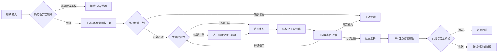

# EquipDoc Agent P2.1 Agentic 升级交接文档

> 本文档面向一个完全没有前文上下文的新对话。请完整阅读后再操作代码。
>
> 当前任务不是重新制作项目，也不是推翻已经发布的 P2，而是在保留高可靠、可审计定位的前提下，增加受约束的 LLM 意图规划、动态工具调用、观察后推理、主动澄清、短期记忆和有引用的自然语言回答。

---

## 1. 项目与用户背景

### 1.1 项目信息

- 项目名称：EquipDoc Agent / 机电运维 Agent
- 本地路径：`C:\Users\MSI\Documents\秋招简历\projects\equipdoc-agent-portfolio`
- GitHub：<https://github.com/yu123-tqy/equipdoc-agent>
- 当前主分支：`main`
- 当前已推送提交：`24b8d71 docs: publish P2 full-mode evaluation evidence`
- P2 正式真实模型评测对应代码提交：`3226c70d57214865bfe99c160c646192caffeef6`

### 1.2 用户目标

用户正在准备秋招，目标方向包括：

- Agent 开发；
- LLM 应用工程；
- AI 产品经理。

这个项目承担“机械专业背景 + 高可靠 LLM 应用工程”的作品集定位。另一个智能座舱 Agent 将更多证明通用工具调用和产品交互能力，但用户希望本项目本身也能更明确地体现大模型在 Agent 中的作用。

### 1.3 用户协作偏好

- 先检查真实代码和运行结果，再做判断；不要凭假设重写。
- 本地主要使用 Windows PowerShell；真实 7B 模型运行在 AutoDL Linux RTX 4090。
- 命令应分步、可复制；不要一次给出大量难以排错的命令。
- 工作期间及时汇报进展，避免长时间没有消息。
- GitHub 提交和推送通常由用户手动完成。
- 不编造准确率、用户量、收益、延迟、Star 数或部署规模。

---

## 2. 为什么要做 P2.1

### 2.1 当前大模型的真实位置

当前 Full 模式中，Qwen2.5-7B 的主要职责是“证据句选择器”：

1. 系统用关键词和 BM25 检索知识；
2. 规则按设备、故障和问题意图重排候选证据句；
3. Qwen 从候选集中选择 4 个证据句 ID；
4. 系统校验 ID；
5. 系统确定性渲染原始证据句和 `doc_id#chunk_id` 引用；
6. 模型格式失败时重试一次，再失败则词法抽取式降级。

Prompt 明确要求模型不能自由生成技术答案，只能输出类似：

```text
EVIDENCE_IDS: E01,E02,E03,E04
```

这套设计解决了最初真实模型回答无引用、混淆 BPFO/BPFI/BSF 和无证据扩写的问题，但也带来了求职展示上的短板。

### 2.2 当前不能充分证明的 Agent 能力

目前以下关键能力主要由规则完成，或尚未实现：

- LLM 自主识别知识问答、信号检查、诊断和澄清意图；
- 根据任务动态选择不同工具；
- 多步骤任务规划；
- 读取工具观察结果后决定下一步；
- 有实际作用的多轮任务记忆；
- 基于证据生成自然、连贯的答案；
- 在信息不足或指代不清时主动提问。

现有诊断工具调用由代码手动构造，安全判断由确定性关键词规则完成，最终诊断报告主要由模板生成。因此当前项目更准确的定位是“规则主导、LLM 增强的高保证 Agent”，而不是“大模型参与规划与执行闭环的 Agent”。

### 2.3 P2.1 目标

P2.1 希望把大模型升级为“受约束的语义规划与回答层”：

- 大模型负责：意图理解、受限计划、工具结果解释、下一步建议、主动澄清和有证据的自然语言表达；
- 确定性系统负责：安全权限、文件路径、参数 Schema、工具白名单、人工审核、引用校验和失败兜底。

目标不是增加最大自主性，而是在可验证范围内让模型真正参与 Agent 决策闭环。

---

## 3. 原项目已经完成的内容

### 3.1 P0：公开可复现作品

- Gradio 演示页面；
- Demo/Full 双模式；
- Windows 启动和健康检查；
- Docker Demo；
- GitHub Actions CI；
- 演示截图和架构说明；
- 上传文件路径、扩展名、大小、数值类型和有限值检查；
- LangGraph 工具调用前 Approve/Reject 人工审核。

### 3.2 P1：离线评测与数据审计

- 30 条 Agent 工作流评测：30/30 通过；
- 100 条 RAG 检索评测：Hit@5 91.0%、MRR@10 76.8%；
- 20 条高风险/证据边界评测：固定安全用例 20/20 通过；
- 知识库：14 篇文档、41 个确定性切片；
- 发现旧 CNN 数据存在同源重叠窗口、随机拆分和全局归一化导致的数据泄漏风险，因此撤回不可复现的 CNN 准确率声明。

### 3.3 P2：真实 Qwen2.5-7B Full 模式

- AutoDL 单卡 RTX 4090；
- 本地 `Qwen2.5-7B-Instruct-EquipDoc`；
- 自建最小 OpenAI-compatible `/v1/chat/completions` 服务；
- 20 条真实模型固定评测：
  - 请求成功率：100%（20/20）；
  - 严格自动用例通过率：70%（14/20）；
  - 平均必需关键词召回率：91.25%；
  - 首轮证据选择成功率：100%；
  - 引用 ID 有效率：100%；
  - 逐句引用覆盖率：100%；
  - 引用原文逐字匹配率：100%；
  - 参考文档命中率：100%；
  - 串行端到端平均延迟：0.417 秒；
  - p50 / p95：0.414 秒 / 0.433 秒。

### 3.4 已有证据和报告

- `docs/p2-full-evaluation-report.md`
- `docs/p2-autodl-full-evaluation.md`
- `artifacts/p2/full_llm_eval.json`
- `artifacts/p2/full_llm_human_review.csv`
- `artifacts/p2/service_check.json`
- `artifacts/p2/smoke_initial_failure.json`
- `artifacts/p2/smoke_v6_safe_2_of_3.json`

P2.1 不应覆盖或改写这些历史产物。新的 Agentic 评测应使用新的文件名和目录。

---

## 4. 已确认的设计方案

### 4.1 总体架构



### 4.2 兼容策略

新增功能必须通过配置显式启用：

```env
EQUIPDOC_DEMO_MODE=false
EQUIPDOC_AGENTIC_MODE=true
EQUIPDOC_AGENT_MAX_STEPS=3
```

兼容要求：

- Demo 模式保持无模型、可公开复现；
- `EQUIPDOC_AGENTIC_MODE=false` 时保持已发布 P2 链路；
- `EQUIPDOC_AGENTIC_MODE=true` 且 Full 模式时进入 P2.1；
- P2.1 出错时不能静默伪装成功，应明确降级或返回错误；
- 原有 P2 评测必须仍然可以复现。

### 4.3 不使用伪原生 Function Calling

当前 `scripts/serve_qwen_openai.py` 的 `ChatRequest` 只支持：

- `model`
- `messages`
- `temperature`
- `top_p`
- `max_tokens`

它不接收 OpenAI `tools`、`tool_choice`，也不会让 tokenizer 根据工具 Schema 生成原生工具调用。

因此 P2.1 第一版采用：

> 严格 JSON Prompt → 本地解析 → Schema/白名单校验 → 系统构造 ToolMessage/执行工具

可以在简历和 README 中写“结构化工具规划”或“受限工具编排”，不能在未扩展服务前写成“原生 Function Calling”。

### 4.4 建议工具集合

#### 1. `diagnose_bearing`

- 已存在；
- 输入信号文件；
- 输出故障类别、置信度、类别概率、信号摘要和警告；
- 必须经过人工 Approve/Reject；
- `signal_path` 只能由系统从状态注入，不能由模型自由填写。

#### 2. `inspect_signal`

- P2.1 新增只读能力；
- 只检查文件和信号摘要，不运行 CNN；
- 输出文件名、采样点数、RMS、峰值、均值、标准差和警告；
- 可以不经过人工审核，但仍必须经过路径沙箱和文件校验。

#### 3. `search_maintenance_knowledge`

- 待实现；
- 将现有 `KnowledgeRetriever` 暴露为真实工具；
- 建议参数：`query`、`equipment`、`fault_type`、`top_k`；
- 返回结构化 hits，包括 `doc_id`、`chunk_id`、`citation`、`title`、`text` 和检索分数；
- `top_k` 应限制在 1～5；
- equipment/fault_type 只能接受系统允许的值；
- 不需要人工审核。

不要为了增加工具数量创建没有独立行为的“回答工具”“报告工具”或空壳函数。

### 4.5 结构化意图与计划 Schema

建议模型严格返回：

```json
{
  "intent": "knowledge_qa",
  "confidence": 0.91,
  "equipment": "bearing",
  "missing_fields": [],
  "clarification_question": "",
  "plan": [
    {
      "step_id": "S1",
      "tool": "search_maintenance_knowledge",
      "arguments": {
        "query": "轴承外圈故障 周期性冲击 BPFO 现场复核",
        "equipment": "bearing",
        "fault_type": "outer_race",
        "top_k": 5
      },
      "depends_on": []
    }
  ]
}
```

建议一级意图白名单：

- `knowledge_qa`
- `diagnosis`
- `signal_inspection`
- `clarification`
- `safety_boundary`

计划校验要求：

- 最大步骤数由 `agent_max_steps` 控制，默认 3，绝不超过 4；
- 工具名必须在白名单；
- 不允许模型传入本地绝对路径；
- diagnosis 没有 signal 时必须转为 clarification；
- 计划格式错误可以重试一次；
- 再失败则回退到当前确定性路由，不得执行未知工具。

### 4.6 工具观察后的决策 Schema

工具执行后，Qwen 读取经过脱敏的结构化观察，再返回：

```json
{
  "action": "call_tool",
  "tool": "search_maintenance_knowledge",
  "arguments": {
    "query": "外圈故障 低置信度 采样不足 现场复核"
  },
  "reason": "诊断倾向外圈故障，但需要补充机理与现场复核证据"
}
```

允许 action：

- `call_tool`
- `answer`
- `clarify`

系统只允许调用初始受限计划中尚未完成、或策略明确允许补充的工具，并限制总步数，防止无限 ReAct 循环。

### 4.7 短期记忆

使用 LangGraph 同一 `thread_id` 的状态保存结构化任务记忆，建议字段：

```python
session_memory = {
    "current_equipment": "bearing",
    "signal_file": "test_signal.npy",
    "last_diagnosis": {
        "fault_type": "外圈故障",
        "confidence": 0.62,
        "warning": "采样长度较短"
    },
    "last_search_query": "外圈故障 现场复核",
    "last_evidence": [],
    "pending_clarification": "",
    "completed_tools": []
}
```

短期记忆应支持：

- “置信度为什么不高？”读取上一轮诊断结果；
- “那接下来检查什么？”沿用上一轮故障类型和证据；
- “换一个文件重新分析”时清除旧文件对应的诊断状态；
- 待澄清问题在下一轮补充后继续执行。

不要实现长期用户画像、跨用户共享记忆、无限聊天记录或把全部对话写入向量库。

### 4.8 基于证据的自然语言回答

推荐保持两阶段：

1. Qwen 从候选中选择证据句；
2. Qwen 根据被选证据和工具观察生成自然语言答案。

建议最终回答分成：

- 工具观察：由系统确定性渲染信号文件、故障结果、置信度和警告；
- 综合解释：由 Qwen 生成，每条技术结论带合法 `doc_id#chunk_id` 引用；
- 现场复核：由 Qwen 基于证据生成并逐句引用；
- 已知边界：明确不能替代现场检查，不能推断剩余寿命或编造工况。

生成守卫至少检查：

- 引用 ID 必须来自本次被选证据；
- 每个技术结论必须带引用；
- 引用不能只挂在整段末尾覆盖多句；
- 技术缩写、频率名和数字不能来自未知来源；
- 禁止出现远程控制、精确剩余寿命、编造设备编号等越权结论；
- 第一版失败后重试一次；
- 第二次失败回退到当前 `render_selected_evidence()` 原文模式。

重要：允许自然语言改写后，“引用原文逐字匹配率 100%”不再适用于自然语言正文。应新增引用覆盖、引用有效、关键词/术语支持和人工证据支持指标；抽取式 fallback 仍可继续报告逐字匹配。

---

## 5. 中断前已经落盘的 P2.1 修改

本轮实现被用户主动中断，以下修改已经写入工作区，但尚未提交 Git。

### 5.1 新增配置

文件：`src/equipdoc_agent/config.py`

已经增加：

```python
agentic_mode: bool
agent_max_steps: int
```

环境变量：

```env
EQUIPDOC_AGENTIC_MODE=false
EQUIPDOC_AGENT_MAX_STEPS=3
```

`agent_max_steps` 会限制在 1～4。

### 5.2 `.env.example`

已经写入 P2.1 opt-in 配置，并明确：

- 只在 Full 模式使用；
- 保持 `false` 可以复现已发布 P2 基线。

### 5.3 新增只读信号检查函数

文件：`src/equipdoc_agent/tools/bearing.py`

已经增加：

```python
inspect_bearing_signal(signal_path, settings)
```

它会：

- 复用现有沙箱路径校验；
- 安全加载 `.npy`；
- 返回 samples、RMS、peak_abs、mean、std；
- 少于 1024 点时提示旧分类器会补零；
- 多于 1024 点时提示旧分类器只取前 1024 点；
- 标准差为 0 时提示缺少变化；
- 不运行 CNN。

文件：`src/equipdoc_agent/tools/__init__.py`

已经导出 `inspect_bearing_signal`。

### 5.4 当前验证结果

已运行：

```powershell
.\.venv\Scripts\python.exe -m unittest discover -s tests -v
```

结果：现有 38 项测试全部通过。

已运行样例信号检查，得到：

```text
agentic_mode=False
max_steps=3
status=ok
mode=signal_inspection
signal_file=test_signal.npy
samples=1024
warnings=[]
```

注意：当前虚拟环境未安装 pytest，运行 `python -m pytest` 会提示 `No module named pytest`；标准库 unittest 可以正常执行。这不是代码失败。

### 5.5 尚未实现

以下功能都还没有开始落盘：

- 结构化意图/计划 Prompt；
- JSON 提取、Schema 校验和规划重试；
- `search_maintenance_knowledge` 工具；
- 在 LangGraph 中注册 `inspect_signal`；
- P2.1 独立 Agentic 图或路由分支；
- 工具观察后的 LLM 决策；
- 结构化短期记忆；
- 自然语言证据综合和新守卫；
- 多轮 UI 调整；
- P2.1 单元测试；
- P2.1 固定评测集和 AutoDL 真实模型评测；
- README、架构和评测报告更新。

不要把当前代码描述成“P2.1 已实现”。目前只是兼容配置和第一个新工具的基础。

---

## 6. 当前 Git 工作区状态与注意事项

创建本交接文件前，工作区存在以下修改：

### 6.1 P2.1 有意修改

- `.env.example`
- `src/equipdoc_agent/config.py`
- `src/equipdoc_agent/tools/__init__.py`
- `src/equipdoc_agent/tools/bearing.py`
- `docs/p2-1-agentic-upgrade-handoff.md`（本交接文件）

### 6.2 与本次升级无关的评测复跑修改

- `artifacts/p1/agent_workflow.json`
- `artifacts/p1/rag_retrieval.json`
- `artifacts/p1/safety_grounding.json`

这 3 个 P1 JSON 是此前复跑评测产生的修改，不要默认把它们加入 P2.1 提交。提交前必须单独核对；若无意更新，应保留用户改动并询问，而不是擅自恢复或删除。

### 6.3 禁止操作

- 不要执行 `git reset --hard`；
- 不要使用 `git checkout --` 丢弃现有改动；
- 不要覆盖 P2 artifacts；
- 不要未经用户确认直接 push；
- 不要把模型权重、`.env`、虚拟环境、缓存或 AutoDL 私有路径提交到 GitHub。

---

## 7. 建议实施顺序

### 阶段 A：结构化规划模块

建议新建：

```text
src/equipdoc_agent/agent/planning.py
```

至少实现：

- `build_intent_plan_messages()`
- `build_intent_plan_retry_messages()`
- `extract_json_object()`
- `parse_and_validate_plan()`
- `fallback_plan()`
- `build_observation_messages()`
- `parse_observation_decision()`

要求：

- JSON 可以从 Markdown code fence 或少量前后文本中安全提取；
- 未知 intent/tool/action 必须拒绝；
- 重复 step_id、循环依赖、步数超限必须拒绝；
- 模型传入的 `signal_path` 必须删除，真实路径只能由系统注入；
- planner 输出不合格时重试一次，再失败走确定性 fallback；
- 规划失败不能执行工具。

先为 parser/validator 写纯单元测试，再接 LangGraph。

### 阶段 B：工具封装

建议：

- 注册已有 `diagnose_bearing`；
- 注册新 `inspect_signal`；
- 新增 `search_maintenance_knowledge`；
- 为工具返回增加 `_tool_name`、`status` 和结构化字段；
- ToolMessage 不暴露绝对路径；
- 搜索工具返回证据 citation，便于后续回答。

工具审核策略：

- `diagnose_bearing`：必须人工审核；
- `inspect_signal`：只读，可直接执行；
- `search_maintenance_knowledge`：只读，可直接执行。

### 阶段 C：独立 Agentic 图

为了不破坏已发布 P2，优先考虑新建：

```text
src/equipdoc_agent/agent/agentic_graph.py
```

在原 `build_graph(settings)` 入口中按配置选择：

```python
if not settings.demo_mode and settings.agentic_mode:
    return build_agentic_graph(settings)
```

否则继续使用现有图。

建议状态字段：

```python
class AgenticState(TypedDict, total=False):
    messages
    signal_path
    review_result
    current_plan
    tool_observations
    tool_step_count
    session_memory
    planning_metadata
    answer_metadata
```

建议节点：

- `planner`
- `policy_gate`
- `review`
- `tools`
- `observer`
- `synthesizer`
- `cancel`

可以根据 LangGraph 实现简化节点数量，但职责和状态必须清楚，不要把所有逻辑塞进一个超大函数。

### 阶段 D：短期记忆与多轮输入

需要特别检查 `app_gradio.py`：当前每次提交都传入：

```python
"signal_path": str(signal_path) if signal_path else ""
```

这可能在后续轮次没有重新上传文件时，用空字符串覆盖 checkpoint 中的旧路径。

建议改为：

```python
payload = {"messages": [HumanMessage(content=text)]}
if signal_path:
    payload["signal_path"] = str(signal_path)
```

但要同时设计：

- 用户上传新文件时清除旧诊断和旧证据；
- 用户明确要求忘记/重置时清理任务记忆；
- 界面保留同一 thread_id 才能继续多轮；
- 记忆里只保存文件名，不向模型提供服务器绝对路径；
- 模型 Prompt 使用精简结构化 memory，不直接塞入无限历史消息。

### 阶段 E：证据化自然语言生成

建议在现有 `knowledge_answer.py` 基础上增加，而不是删除原实现：

- `build_grounded_synthesis_messages()`
- `build_grounded_synthesis_retry_messages()`
- `validate_grounded_draft()`
- `render_tool_observation_section()`

推荐执行：

1. 搜索获得 hits；
2. 复用现有证据句候选与选择；
3. 将被选证据、脱敏工具观察和用户问题发给 Qwen；
4. Qwen 生成带逐句引用的解释和建议；
5. 系统执行引用、安全和术语支持校验；
6. 失败重试一次；
7. 再失败使用现有抽取式答案。

工具结果与知识结论分开：

- 工具观察部分由系统确定性渲染；
- 机理、复核和建议由 LLM 基于知识证据生成；
- 不要让知识文档引用替工具结果背书，也不要让工具置信度冒充开放域正确率。

### 阶段 F：测试

至少新增：

```text
tests/test_agentic_planning.py
tests/test_agentic_graph.py
tests/test_agentic_memory.py
tests/test_grounded_generation.py
```

必须覆盖：

1. 合法知识问答计划；
2. 诊断无信号时主动澄清；
3. 模型试图传入任意路径时被系统覆盖/拒绝；
4. `inspect_signal` 只读执行；
5. 诊断仍触发 Approve/Reject；
6. 诊断结果后模型选择知识检索；
7. 达到最大步数后停止继续调用；
8. 未知工具不执行；
9. 工具错误后澄清或降级；
10. 同一 thread_id 第二轮能读取上一轮 fault_type/confidence；
11. 新文件清理旧诊断记忆；
12. 自然语言答案逐句引用；
13. 无效引用触发重试；
14. 两次失败回退抽取式答案；
15. `agentic_mode=false` 时现有 P2 测试保持通过；
16. Demo 模式完全不调用 7B 模型。

本地每个有意义的修改批次后运行：

```powershell
.\.venv\Scripts\python.exe -m unittest discover -s tests -v
.\.venv\Scripts\python.exe -m equipdoc_agent.health --strict
.\.venv\Scripts\python.exe scripts\demo_smoke.py
```

### 阶段 G：P2.1 评测

不要复用或覆盖 `full_llm_eval20.jsonl` 和 `full_llm_eval.json`。

建议新增：

```text
data/eval/agentic_eval.jsonl
scripts/eval_agentic_full.py
artifacts/p2_1/
docs/p2-1-agentic-evaluation-report.md
```

建议评测维度：

- 意图识别；
- 工具选择；
- 工具参数合法性；
- 多步骤计划完整性；
- 主动澄清；
- 工具观察后的下一步；
- 高风险确认/拒绝；
- 多轮记忆；
- 引用有效性；
- 回答证据支持；
- 降级率；
- 总调用次数和端到端延迟。

建议初始规模：

- 单轮意图/工具：20～30 条；
- 安全和澄清：15～20 条；
- 多轮记忆：8～12 组；
- 端到端诊断链路：10～20 条。

先建立小型 Smoke Test，再跑正式集。不要一开始制作过大的评测集。

---

## 8. 不能破坏的安全和真实性边界

### 8.1 安全控制不能交给模型

以下必须继续由确定性代码控制：

- 文件沙箱和扩展名；
- 上传大小；
- NaN/Inf 和数值类型；
- 工具白名单；
- 最大步骤数；
- 高风险和越权请求；
- 诊断工具人工审批；
- 真实设备控制边界；
- 本地路径注入；
- 未知工具拒绝。

LLM 可以提出计划，但不能批准自己的计划。

### 8.2 不得夸大的指标

- 不能写“大模型回答准确率 100%”；
- 不能写“groundedness 100%”；
- 不能写“工业故障诊断准确率 100%”；
- 不能写“平均生成 18 Token”；
- 不能写“系统达到真实工业部署要求”；
- 不能写“原生 Function Calling”，除非服务协议和模型调用真的完成；
- 不能使用旧 CNN 准确率；
- 不能在人工评审为空时声称人工正确率。

### 8.3 P2.1 新指标必须重新测量

旧 P2 的 14/20、91.25%、100% 引用逐字匹配和 0.433 秒 p95 只对应旧链路。

P2.1 增加多次模型调用后：

- 延迟一定会变化；
- 调用次数会增加；
- 自然语言改写不再满足逐字匹配；
- 错误类型会从证据选择扩展到计划、工具参数、记忆和生成。

因此 P2.1 必须单独报告，不能直接沿用旧数字。

### 8.4 不针对固定题目硬编码

- 不要把评测问题关键词直接写入 planner；
- 不要为每个测试用例写专用工具计划；
- 规则只能描述通用安全边界和参数约束；
- 失败案例应保留并分析，不能为了 100% 通过率不断在固定集上打补丁。

---

## 9. P2.1 完成标准

P2.1 可以宣布完成，至少需要同时满足：

- 配置开启后确实调用 Qwen 做结构化意图/计划；
- 至少存在诊断、信号检查、知识检索 3 个有实际行为的工具；
- 模型可以根据任务选择不同工具；
- 诊断链路包含至少一次“工具观察 → 模型下一步决策”；
- 缺少信号或关键信息时会主动澄清；
- 同一 thread_id 的第二轮能使用上一轮结构化状态；
- 诊断工具仍需人工审核；
- 自然语言答案包含合法逐句引用；
- 生成失败时能回退到现有抽取式答案；
- 最大步数和未知工具限制有效；
- Demo、旧 P2 和新 P2.1 测试全部通过；
- AutoDL 真实模型 Smoke Test 完成；
- 正式评测产物、配置、Git commit 和失败分析可追溯；
- README 和架构文档明确区分 Demo、P2 baseline、P2.1 agentic 三种模式。

---

## 10. 新对话的第一轮操作要求

新对话开始后，不要立即重新设计。按以下顺序：

1. 阅读本交接文件；
2. 执行 `git status --short`；
3. 阅读上述 4 个已修改 P2.1 文件的 diff；
4. 运行现有 38 项 unittest，确认基线没有变化；
5. 检查 `graph.py`、`knowledge_answer.py`、`policy.py`、`safety.py`、`app_gradio.py` 和 `serve_qwen_openai.py`；
6. 向用户用一句话确认：当前只完成配置和信号检查基础，Agentic 主链尚未实现；
7. 先实现纯结构化 planning 模块及单元测试；
8. 再接工具和 LangGraph；
9. 每完成一个阶段就汇报真实测试结果；
10. 本地完成后再指导用户到 AutoDL 验证真实 Qwen。

建议新对话的第一条回复：

> 我已经读完交接文档并核对工作区。当前 P2 基线仍在，P2.1 只落盘了配置开关和只读信号检查工具，38 项旧测试通过；结构化规划、动态工具、观察后推理、短期记忆和自然语言证据生成尚未实现。我将先建立规划 Schema、解析校验和对应单元测试，然后再接入独立 Agentic 图，避免破坏旧 P2。

---

## 11. 未来可用于简历的表述框架

以下只能在 P2.1 真实评测完成后填入数据：

> 在原有可审计 RAG 基础上，为 Qwen2.5-7B 增加结构化意图识别、受限多步骤规划和工具观察后决策，编排信号检查、轴承诊断与知识检索 3 类工具；使用 LangGraph checkpoint 保存设备、诊断结果、证据和待澄清事项，并通过确定性安全门、人工审批、逐句引用校验及抽取式降级约束模型。构建 `[待实测]` 条 Agentic 评测，取得意图识别 `[待实测]`、工具选择 `[待实测]`、高风险误执行率 `[待实测]`、多轮任务通过率 `[待实测]` 和 p95 `[待实测]`。

所有 `[待实测]` 必须来自仓库正式产物后才能进入简历。

